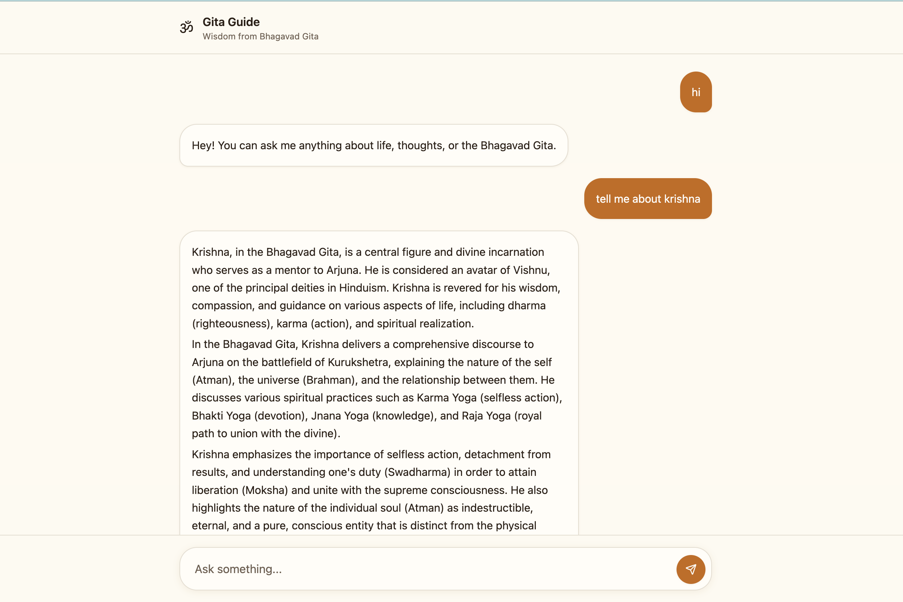

# 🕉️ Gita Chat — Local AI Bhagavad Gita Assistant (Ollama Powered)

An AI-powered chatbot that provides spiritual guidance and answers from the *Bhagavad Gita*, running entirely on a **local LLM using Ollama** — ensuring privacy, speed, and zero API cost.

---

## 📸 Demo

### 🏠 Home Screen

---

## ✨ Features

- 📖 Ask questions about the Bhagavad Gita  
- 🤖 Fully local AI (no OpenAI API required)  
- 🔐 Privacy-first — runs completely offline  
- ⚡ Fast responses using Ollama  
- 💬 Clean and responsive chat UI  
- 🧠 Context-aware answers  
- 🔍 Optional RAG (Retrieval-Augmented Generation) support  

---

## 🛠️ Tech Stack

### Frontend
- React.js / Next.js  
- TypeScript  
- Tailwind CSS  

### Backend
- Node.js  
- Express.js  

### AI / LLM
- Ollama (Local LLM server)  
- Models: `llama3`, `mistral`  

### Database (Optional)
- MongoDB / PostgreSQL  

---

### ⚙️ Installation

## 1. Clone the repository
git clone https://github.com/your-username/gita-chat.git
cd gita-chat

## 2. Install backend dependencies
cd backend
npm install

## 3. Install frontend dependencies
cd ../frontend
npm install

## 4. Install & setup Ollama (if not installed)
### Visit: https://ollama.com

## Pull a model (choose one)
ollama pull llama3
## or
ollama pull mistral

## Start Ollama server
ollama serve

## 5. Setup environment variables
## Create a .env file inside backend/

echo "OLLAMA_BASE_URL=http://localhost:11434
MODEL=llama3
PORT=5000" > backend/.env

## 6. Run backend
cd backend
npm run dev

## 7. Run frontend
cd ../frontend
npm run dev

## App will be running at:
## http://localhost:8080
